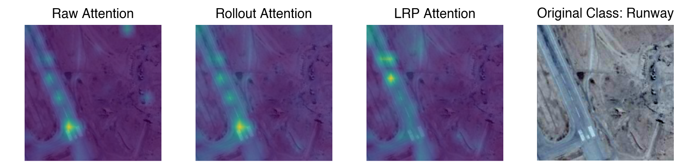
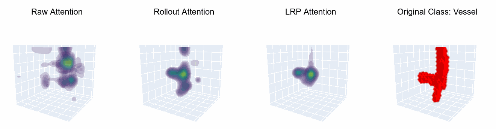
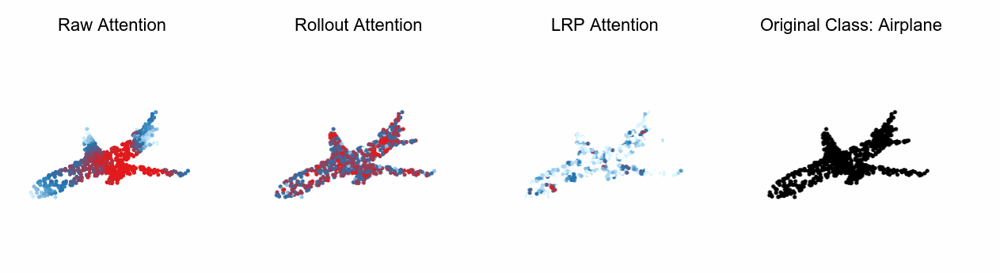

<br />
<p align="center">
  <a href=" ">
     
  </a>

  <h1 align="center">Large-scale Attribution & Attention Evaluation in Computer Vision <i>(REVIEWER VERSION)</i></h1>

  <p align="center">
    <a href=""><strong>Read the paper »</strong></a>
    <br />

  </p>
</p>

Benchmark XAI Methods and Evaluation Metrics for various Computer Vision Modalities, Datasets and Model Architectures.

> Abstract: <br>*Explainable AI (XAI) is a rapidly growing domain with a myriad of methods as well as metrics aiming to evaluate their efficacy. However, current literature is often of limited scope, examining only a handful of XAI methods and employing one or a few metrics. Furthermore, pivotal factors for performance, such as the underlying architecture or the nature of input data, remain largely unexplored. This lack of comprehensive analysis hinders the ability to make generalized and robust conclusions about XAI performance, which is crucial for directing scientific progress but also for trustworthy real-world application of XAI. In response, we introduce LATEC, a large-scale benchmark that critically evaluates 17 prominent XAI methods using 20 distinct metrics. Our benchmark systematically incorporates vital elements like varied architectures and diverse input types, resulting in 7,560 examined combinations. Using this benchmark, we derive empirically grounded insights into areas of current debate, such as the impact of Transformer architectures and a comparative analysis of traditional attribution methods against novel attention mechanisms. To further solidify LATEC's position as a pivotal resource for future XAI research, all auxiliary data—from trained model weights to over 326k saliency maps and 378k metric scores—are made publicly available.*

<br>
<p align="center">
     <br>
     <br>
    
</p>


## 📝&nbsp;&nbsp;Citing this Work

If you use LATEC please cite our [paper]()

```bibtex
@inproceedings{}
```

## 🧭&nbsp;&nbsp;Table of Contents
* [Installation](#Installation)
* [Project Structure](#project-structure)
* [LATEC Dataset](#latec-dataset)
* [Getting started](#getting-started)
  * [Reproducing the Results](#reproducing-the-results)
  * [Run your own Experiments](#run-your-own-experiments)
* [Acknowledgements](#acknowledgements)

## ⚙️&nbsp;&nbsp;Installation

LATEC requires Python version 3.9 or later. All essential libraries for the execution of the code are installed when installing this repository:

```bash
git clone https://github.com/link/to/repository
cd LATEC
pip install .
````
Depending on your GPU, you need to install an appropriate version of PyTorch and torchvision separately. All scripts run also on CPU, but can take substantially longer depending on the experiment. Testing and development were done with the Pytorch version using CUDA 11.6. 

## 🗃&nbsp;&nbsp;Project Structure


```
├── configs                   - Hydra config files
│   ├── callbacks
│   ├── data
│   ├── eval_method
│   ├── experiment
│   ├── explain_method
│   ├── extras
│   ├── hydra
│   ├── logger
│   └── paths                 
├── data                      - Data storage and ouput folders
│   ├── datasets              - Datasets for all modalities
│   ├── evaluation            - Evaluation scores as .npz
│   ├── saliency_mapss      - Saliency maps output as .npz
│   ├── figures               - Output of figures and gifs
│   └── model_weights         - Model weights as .ckpt files
├── logs                      - Log files             
├── notebooks                 - Notebooks for visualizations
├── scripts                   - Bash scripts for multi-runs
├── src                       
│   ├── data                  - Datamodules scripts
│   ├── modules               
│   │   ├── components        - Various submodules
│   │   ├── eval_methods.py   - Loads evaluation metrics
│   │   ├── models.py         - Loads deep learning models
│   │   └── xai_methods.py    - Loads XAI methods
│   └── utils                 - Various utility scripts
├── main_eval.py              - Runs evaluation pipeline
├── main_explain.py           - Runs explanation pipeline
└── main_rank.py              - Runs ranking pipeline
```

## 💾&nbsp;&nbsp;LATEC Dataset
If you want to reproduce only certain results or use our provided model weights, saliency maps, or evaluation scores for your own experiments, please download them here:

- All model weights: [Download](https://polybox.ethz.ch/index.php/s/hSInbioeXqZyDfQ), and unzip them at `./data/`.
- Saliency maps per dataset: [Download](https://libdrive.ethz.ch/index.php/s/4tm0gxcvBqvMlRA), move them in the respective modality folder and unzip them at `./data/*modality*/`.
- All evaluation scores: [Download](https://polybox.ethz.ch/index.php/s/oH5A4MTGMJVSN1F), and unzip them at `./data/`.

## 🚀&nbsp;&nbsp;Getting started 
### ♻️&nbsp;Reproducing the Results
In the case of the [CoMA](https://coma.is.tue.mpg.de/) and [RESISC45](http://www.escience.cn/people/JunweiHan/NWPU-RESISC45.html) datasets, please download the datasets directly from their websites. All other datasets are downloaded automatical into the `./data/datasets/` folder when running the experiment for the first time.

#### **Saliency Maps**
Select the respective .yaml config for the respective dataset from `./config/data/` and modality for the config of the XAI methods from `./config/explain_method/`. Then run a command with both specified such as:
```bash
latec-explain data=vesselmnist3d.yaml explain_method=volume.yaml
```
#### **Evaluation Scores**
For score computation define in addition to the `data` and `explain_method` also the `./config/eval_method/` dataset and add the file name of the .npz file containing the saliency maps, located at `./data/saliency_maps/*modality*/`. Then run a command with all four specified such as:
```bash
latec-eval data=vesselmnist3d.yaml explain_method=volume.yaml eval_method=volume_vessel.yaml attr_path='saliency_maps_vesselmnist3d.npz'
```
#### **Ranking Tables**
Run the following command but make sure that the paths in `./config/rank.yaml` lead to the correct evaluation score .npz files and the right ranking shema is selected.
```bash
latec-rank
```
<br>

If you want to run all three steps in sequence run the bash script `./scripts/run_all_steps.sh` with the respective config files filled out (This can take a substantial amount of time even with GPU resources!).

<br>

### 🧪&nbsp;Run your own Experiments

#### Own **Dataset** and **Model Weights**
1. Add a dataset to `./data/datasets/` and model weights as .ckpt file to `./data/model_weights/`
2. Add *LightningDataModule* file to `./src/data/` and *config.yaml* to `./config/data` (must specify *\_target_* in .yaml file).
3. Initilize model and load weights in *ModelsModule.\_\_init__* (from `./src/modules/models.py`) at the respective modality and append it to the *self.models* list.
4. Add layer for CAM methods in *XAIMethodsModule.\_\_init__* (from `./src/modules/xai_methods.py`) and for Rel. Representation Stability metric in *EvalModule.\_\_init__* (from `./src/modules/eval_methods.py`).
#### Own **XAI Method**
1. Add XAI method parameters to the respective config file at `./config/explain_methods/*modality*.yaml`
2. Initilize XAI method in *XAIMethodsModule.\_\_init__* (from `./src/modules/xai_methods.py`), and append it to *self.xai_methods* and the parameters from *self.xai_cfg* as a dictionary to *self.xai_hparams*.
3. Make sure that your XAI method object has a method *.attribute(input, target, \*\*hparams)* that has as input a single observation, the target and the parameters as a dictionary, and outputs the saliency map as a numpy array or torch tensor.
#### Own **Evaluation Metric**
1. Add evaluation metric parameters to the respective config file at `./config/eval_methods/*dataset*.yaml`
2.  Initilize evaluation metric in *EvalModule.\_\_init__* (from `./src/modules/eval_methods.py`) and apply it in *EvalModule.evaluate()* as *YourMetric(x_batch,y_batch,a_batch,device)* that takes as an input at least the batches of observations (*x_batch*), targets (*y_batch*) and saliency maps (*a_batch*) together with respective *device* and outputs the scores as a numpy array which is appended to *eval_scores*.
## 📣&nbsp;&nbsp;Acknowledgements

The code is developed by the authors of the paper. However, it does also contain pieces of code from the following packages:

- Captum by Kokhlikyan, Narine et al.: https://github.com/pytorch/captum
- Quantus by Hedström, Anna et al.: https://github.com/understandable-machine-intelligence-lab/Quantus
- Pytorch EfficientNet 3D by Shi, Jian: https://github.com/shijianjian/EfficientNet-PyTorch-3D
- Pytorch Point Cloud Transformer by Guo, Meng-Hao et al.: https://github.com/Strawberry-Eat-Mango/PCT_Pytorch
- Pytorch Transformer-Explainability by Chefer, Hila et al.: https://github.com/hila-chefer/Transformer-Explainability
